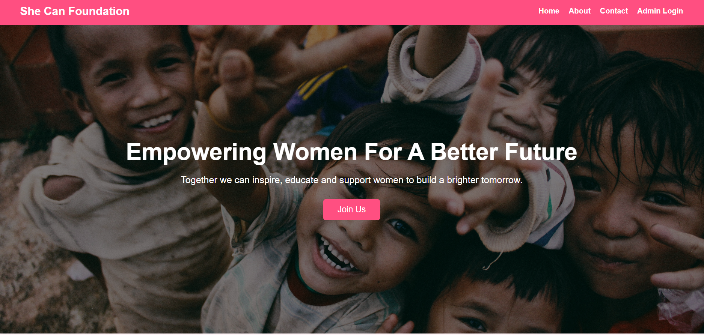
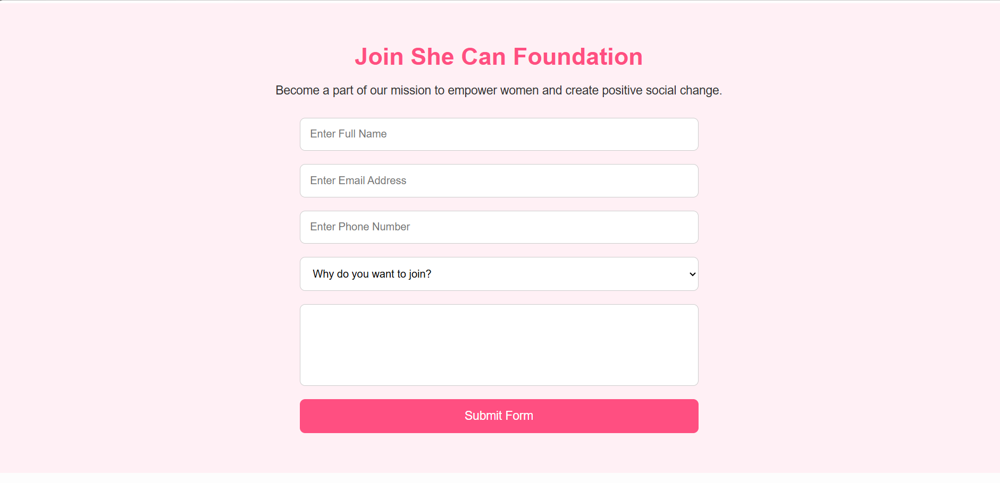
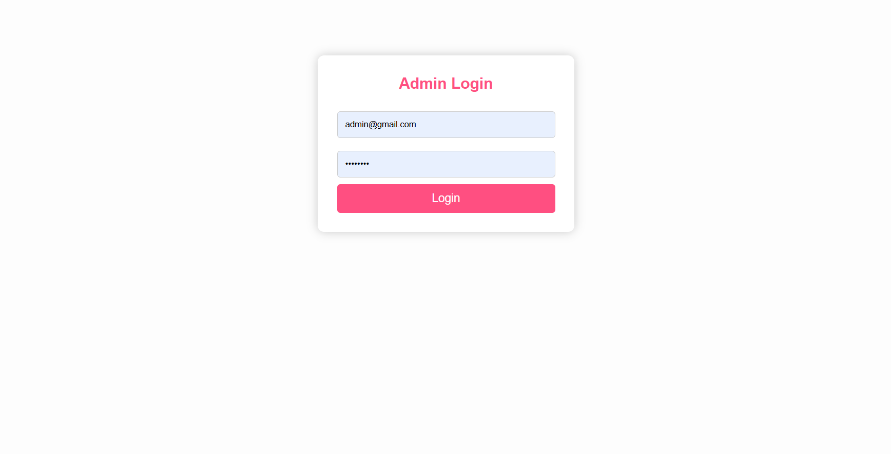
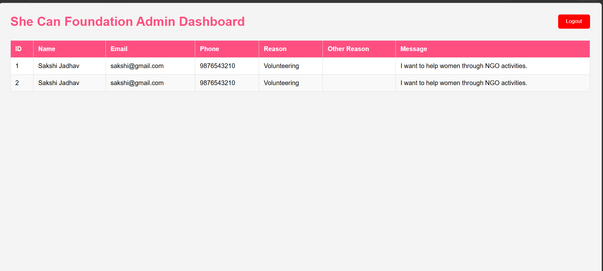

# She Can Foundation

A secure NGO volunteer onboarding platform built using Spring Boot, Spring Security, JWT Authentication, MySQL, HTML, CSS, and JavaScript.

---

# 📌 Project Overview

She Can Foundation is a web application developed to support NGO volunteer registration and management.

The platform allows visitors to learn about the NGO and submit volunteer applications through an online form. Administrators can securely log in and view submitted applications through a protected dashboard.

---

# 🚀 Features

## Public User Features

* View NGO information
* Learn about the foundation's mission
* Submit volunteer application form
* Select reason for joining NGO
* Provide custom reason when "Other" is selected
* Responsive and user-friendly interface

## Admin Features

* Secure Admin Login
* JWT Authentication
* Spring Security Integration
* Protected Admin Dashboard
* View Volunteer Applications
* Logout Functionality

---

# 🛠️ Tech Stack

## Frontend

* HTML5
* CSS3
* JavaScript

## Backend

* Spring Boot
* Spring Security
* JWT Authentication
* Spring Data JPA
* Maven

## Database

* MySQL

---

# 📂 Project Structure

```text
she-can-foundation
│
├── frontend
│   ├── index.html
│   ├── admin-login.html
│   ├── admin-dashboard.html
│   ├── style.css
│   └── script.js
│
├── backend
│   ├── src
│   ├── pom.xml
│   └── application.properties
│
├── screenshots
│
└── README.md
```

---

# 🔐 Authentication Flow

1. Admin enters email and password.
2. Spring Security validates credentials.
3. JWT token is generated.
4. Token is stored in browser localStorage.
5. Protected APIs require Authorization header.
6. Unauthorized users cannot access admin resources.

---

# 🗄️ Database Schema

## users

| Column   | Description        |
| -------- | ------------------ |
| id       | User ID            |
| name     | Admin Name         |
| email    | Admin Email        |
| password | Encrypted Password |
| role     | ADMIN              |

---

## join_forms

| Column      | Description        |
| ----------- | ------------------ |
| id          | Form ID            |
| name        | Applicant Name     |
| email       | Applicant Email    |
| phone       | Contact Number     |
| reason      | Selected Reason    |
| otherReason | Custom Reason      |
| message     | Additional Message |

---

# 🌐 API Endpoints

## Authentication

### Login

```http
POST /api/auth/login
```

Request Body

```json
{
  "email": "admin@gmail.com",
  "password": "admin123"
}
```

---

## Volunteer Form Submission

```http
POST /api/form/submit
```

---

## Admin Dashboard

```http
GET /api/admin/forms
```

Authorization Header Required

```text
Authorization: Bearer JWT_TOKEN
```

---

# 📸 Screenshots

## Home Page

```md

```

## Why Join Section

```md

```

## Join Form

```md

```

## Admin Login

```md

```

## Admin Dashboard

```md

```

---

# ⚙️ Installation & Setup

## Clone Repository

```bash
git clone https://github.com/your-username/she-can-foundation.git
```

---

## Backend Setup

Navigate to backend folder:

```bash
cd backend
```

Configure MySQL database in:

```properties
application.properties
```

Example:

```properties
spring.datasource.url=jdbc:mysql://localhost:3306/shecanfoundation
spring.datasource.username=root
spring.datasource.password=YOUR_PASSWORD

spring.jpa.hibernate.ddl-auto=update
```

Run Spring Boot Application:

```bash
mvn spring-boot:run
```

---

## Frontend Setup

Open:

```text
frontend/index.html
```

using Live Server or any local web server.

---

# 🔒 Security Features

* BCrypt Password Encoding
* JWT Token Authentication
* Protected Admin APIs
* Spring Security Configuration
* Role-Based Access Control

---

# 🎯 Future Enhancements

* Email Notifications
* Volunteer Status Tracking
* Event Management Module
* Admin Profile Management
* Analytics Dashboard
* Cloud Deployment

---


